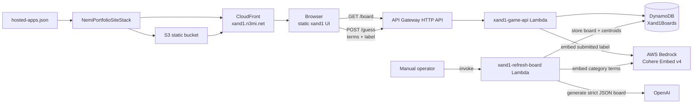
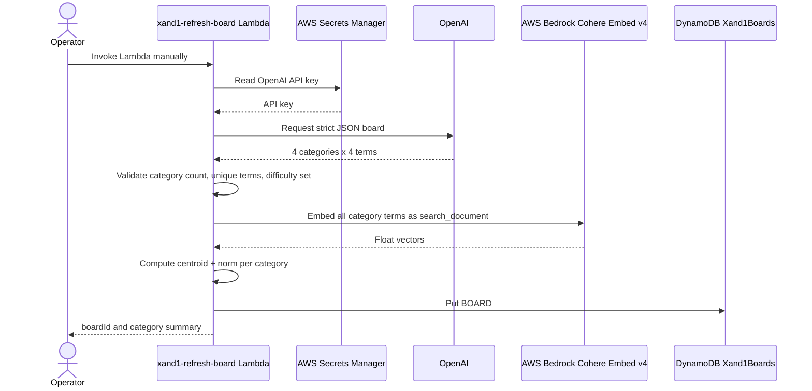
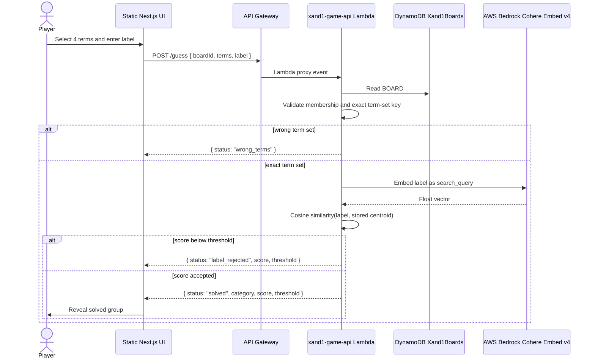
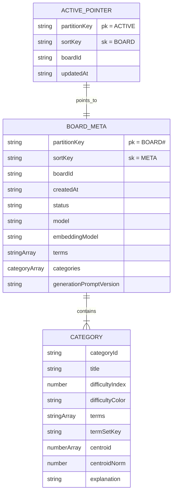

# xand1

`xand1` is a standalone hosted app for a 4x4 Connections-style word game. A player must select four related terms and submit a category label in the same move. The backend validates both the exact term set and the semantic fit of the submitted label.

## Gameplay

- The board has 16 shuffled terms, grouped into four hidden categories.
- A guess contains exactly four selected terms plus a category name.
- The selected terms must exactly match one category.
- The category name is embedded with Cohere Embed v4 on AWS Bedrock and compared with the stored centroid for that category.
- A solve reveals only the matched category title, color, terms, and explanation.
- Wrong term sets do not reveal answer data.
- Correct terms with a weak label return the score and threshold, but still do not reveal the title.

## Architecture



### Frontend

The frontend lives entirely in `projects/xand1` and uses a static Next.js export:

- `src/app/page.tsx`: page entry.
- `src/components/game/*`: board, tile, solved group, and guess tray UI.
- `src/components/ui/*`: local shadcn-style primitives used by the game.
- `src/lib/api.ts`: typed HTTP client for the game API.
- `src/lib/contracts.ts`: public board and guess response contracts.
- `src/lib/game.ts`: client helpers for term-set normalization and difficulty colors.

The UI is intentionally minimal: white background, black text, rounded 4x4 tiles, and solved groups colored with the backend-provided parula-like ramp.

### Backend

The backend is defined in the infra workspace:

- `infra/lib/xand1-api-stack.ts`: DynamoDB table, HTTP API, Lambdas, IAM grants, and outputs.
- `infra/lambda/xand1/refresh-board.ts`: private/manual board generation path.
- `infra/lambda/xand1/game-api.ts`: public `/board` and `/guess` API.
- `infra/lambda/xand1/shared/embedding.ts`: Bedrock embedding, centroid, cosine, and term-set helpers.
- `infra/lambda/xand1/shared/dynamo.ts`: DynamoDB read/write helpers.
- `infra/lambda/xand1/shared/validation.ts`: generated-board schema validation and difficulty colors.
- `infra/lambda/xand1/shared/types.ts`: stored board and API contract types.

## Generation flow



## Guess validation flow



## DynamoDB data model



The public `GET /board` response returns only:

```ts
type BoardResponse = {
  boardId: string
  terms: string[]
  difficultyColors: string[]
}
```

It intentionally omits titles, category term sets, centroids, and explanations.

## API

### `GET /board`

Returns the active public board.

```json
{
  "boardId": "...",
  "terms": ["Oxygen", "Mango", "Madrid"],
  "difficultyColors": ["#352A87", "#0F5CDD", "#00A6A6", "#F9D423"]
}
```

### `POST /guess`

Request:

```json
{
  "boardId": "...",
  "terms": ["Mango", "Banana", "Fig", "Apple"],
  "label": "Fruits"
}
```

Possible responses:

```ts
type GuessResponse =
  | { status: 'wrong_terms'; message: string }
  | { status: 'label_rejected'; message: string; score: number; threshold: number }
  | {
      status: 'solved'
      category: {
        title: string
        color: string
        difficultyIndex: number
        terms: string[]
        explanation?: string
      }
      score: number
      threshold: number
    }
```

## Configuration

### Frontend

`NEXT_PUBLIC_XAND1_API_BASE_URL` must be set at build time because the app is statically exported.

```bash
NEXT_PUBLIC_XAND1_API_BASE_URL=https://<api-id>.execute-api.us-east-1.amazonaws.com npm run build:xand1
```

### Backend CDK context and environment

`Xand1ApiStack` accepts these context values or environment variables:

| Context key | Environment variable | Purpose |
| --- | --- | --- |
| `xand1OpenAiApiKeySecretArn` | `XAND1_OPENAI_API_KEY_SECRET_ARN` | Secrets Manager ARN containing the OpenAI API key. |
| `xand1OpenAiModel` | `XAND1_OPENAI_MODEL` | OpenAI model for board generation. Defaults to `gpt-5.5`. |
| `xand1BedrockModelId` | `XAND1_BEDROCK_MODEL_ID` | Bedrock embedding model. Defaults to `cohere.embed-v4:0`. |
| `xand1CategoryLabelThreshold` | `XAND1_CATEGORY_LABEL_THRESHOLD` | Cosine acceptance threshold. Defaults to `0.35`. |

The OpenAI secret may be a plain secret string or JSON containing one of:

- `OPENAI_API_KEY`
- `openaiApiKey`
- `apiKey`

## Local build and preview

From the repo root:

```bash
npm run build:xand1
```

For a local preview with a deployed API:

```bash
NEXT_PUBLIC_XAND1_API_BASE_URL=https://<api-id>.execute-api.us-east-1.amazonaws.com npm run build:xand1
cd projects/xand1
node ../../scripts/serve-hosted-apps.mjs
```

The preview server serves the static export at `http://localhost:3000`.

## Deployment and board refresh

Deploy the API stack from the repo root:

```bash
npm --prefix infra run cdk -- deploy Xand1ApiStack \
  --require-approval never \
  -c xand1OpenAiApiKeySecretArn=<secret-arn>
```

Generate or refresh the active board:

```bash
aws lambda invoke \
  --function-name xand1-refresh-board \
  /tmp/xand1-refresh-output.json
```

Check the public board endpoint:

```bash
curl https://<api-id>.execute-api.us-east-1.amazonaws.com/board
```

Static hosting for `xand1.n3mi.net` is registered in `hosted-apps.json` and deployed by `NemiPortfolioSiteStack` with the other hosted apps.

## Tests

Frontend helper tests:

```bash
npm --prefix projects/xand1 run test
```

Backend helper and validation tests:

```bash
npm --prefix infra run test:xand1
```

Infra build and synth:

```bash
npm --prefix infra run build
npm --prefix infra run synth
```
