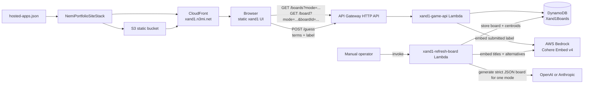
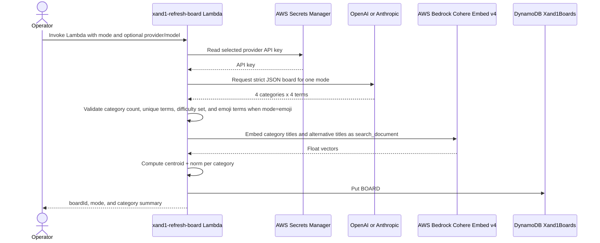
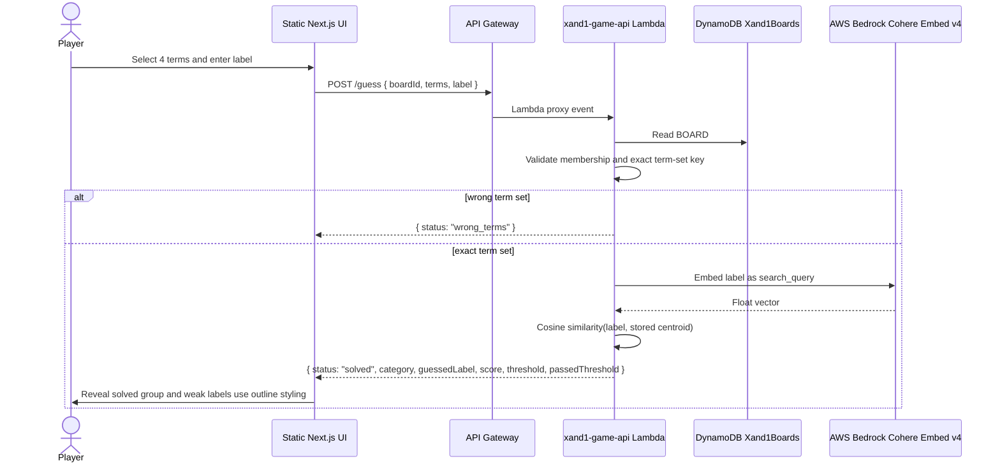
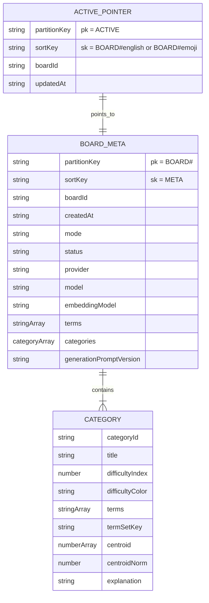

# xand1

`xand1` is a statically hosted 4x4 Connections-style game. Players select four terms and submit the category name in the same move; the API checks both the exact term set and the semantic fit of the submitted label.

Current production:

- Site: `https://xand1.n3mi.net`
- API: `https://ar02bn9qz6.execute-api.us-east-1.amazonaws.com`
- Active boards use Anthropic `claude-fable-5` (`95cf7d2e-ca4f-4a4a-a141-d9a5848bed97` English, `29458db9-dd50-49b0-9847-3f4051333a30` emoji).
- OpenAI generation is still supported for manual refreshes.

## Gameplay

- Boards have 16 shuffled terms in four hidden categories.
- Emoji boards use emoji terms and English category labels for scoring.
- Exact term-set misses return only `wrong_terms`; answer data stays hidden.
- Exact term-set hits embed the submitted label with Cohere Embed v4 on Bedrock and compare it to the stored category centroid.
- Solves reveal title, terms, explanation, submitted label, score, threshold, and weak-label outline styling when applicable.

## Architecture



Key paths:

- `projects/xand1/src/components/game/*`: game UI, board selector, tiles, solved groups, and guess tray.
- `projects/xand1/src/lib/api.ts`: public API client.
- `projects/xand1/src/lib/contracts.ts`: public response/request types.
- `projects/xand1/src/lib/game.ts`: client helpers, scoring display helpers, and model-label abbreviations.
- `infra/lib/xand1-api-stack.ts`: DynamoDB table, GSI, HTTP API, Lambdas, IAM grants, and outputs.
- `infra/lambda/xand1/refresh-board.ts`: manual OpenAI/Anthropic board generation.
- `infra/lambda/xand1/game-api.ts`: public `/boards`, `/board`, `/guess`, and `/warm`.
- `infra/lambda/xand1/shared/*`: DynamoDB, embedding, validation, and shared types.

## Generation flow



Refresh behavior:

- `provider` is `openai` or `anthropic`; omitted provider defaults to `openai`.
- OpenAI defaults to `gpt-5.5`.
- Anthropic/Fable requires `XAND1_ANTHROPIC_MODEL` or an event `model`; production uses `claude-fable-5`.
- Secrets may be JSON (`OPENAI_API_KEY`, `ANTHROPIC_API_KEY`, `openaiApiKey`, `anthropicApiKey`, or `apiKey`) or a plain secret string.

## Guess validation flow



## DynamoDB data model



Board metadata records are also indexed by `mode` + `createdAt` through the `BoardsByModeCreatedAt` GSI for the board selector.

## API

Public board endpoints never return category answers, centroids, or term sets.

### `GET /boards?mode=english|emoji`

Returns board summaries for the dropdown, oldest first (`#1`, `#2`, ...). Missing `mode` defaults to English.

```ts
type BoardListResponse = {
  boards: Array<{
    boardId: string
    mode: 'english' | 'emoji'
    createdAt: string
    model: string
    provider: 'openai' | 'anthropic'
    isActive: boolean
  }>
}
```

### `GET /board?mode=english|emoji&boardId=<id>`

Returns the active board for `mode`, or the requested board when `boardId` is present.

```ts
type BoardResponse = {
  boardId: string
  mode: 'english' | 'emoji'
  terms: string[]
  difficultyColors: string[]
}
```

### `POST /guess`

```ts
type GuessRequest = {
  boardId: string
  terms: string[]
  label: string
}

type GuessResponse =
  | { status: 'wrong_terms'; message: string; oneAway: boolean }
  | {
      status: 'solved'
      category: {
        title: string
        color: string
        difficultyIndex: number
        terms: string[]
        explanation?: string
      }
      guessedLabel: string
      score: number
      threshold: number
      passedThreshold: boolean
    }
```

## Configuration

`NEXT_PUBLIC_XAND1_API_BASE_URL` is required at static build time. Hosted app builds can load it from the xand1 JSON secret named by `XAND1_OPENAI_API_KEY_SECRET_ARN`; explicit environment variables override the secret.

`Xand1ApiStack` context/env:

| Context key | Environment variable | Purpose |
| --- | --- | --- |
| `xand1OpenAiApiKeySecretArn` | `XAND1_OPENAI_API_KEY_SECRET_ARN` | OpenAI secret ARN. |
| `xand1OpenAiModel` | `XAND1_OPENAI_MODEL` | OpenAI model; defaults to `gpt-5.5`. |
| `xand1AnthropicApiKeySecretArn` | `XAND1_ANTHROPIC_API_KEY_SECRET_ARN` | Anthropic secret ARN. |
| `xand1AnthropicModel` | `XAND1_ANTHROPIC_MODEL` | Anthropic model; production uses `claude-fable-5`. |
| `xand1BedrockModelId` | `XAND1_BEDROCK_MODEL_ID` | Bedrock embedding model; defaults to `cohere.embed-v4:0`. |
| `xand1CategoryLabelThreshold` | `XAND1_CATEGORY_LABEL_THRESHOLD` | Cosine acceptance threshold; defaults to `0.35`. |

## Build, deploy, refresh

From the repo root:

```bash
npm --prefix projects/xand1 run test
npm --prefix infra run test:xand1
npm --prefix infra run build
npm --prefix infra run synth
NEXT_PUBLIC_XAND1_API_BASE_URL=https://ar02bn9qz6.execute-api.us-east-1.amazonaws.com npm run build:xand1
```

Deploy API:

```bash
npm --prefix infra run cdk -- deploy Xand1ApiStack \
  --require-approval never \
  -c xand1OpenAiApiKeySecretArn=<openai-secret-arn> \
  -c xand1AnthropicApiKeySecretArn=<anthropic-secret-arn> \
  -c xand1AnthropicModel=claude-fable-5
```

Refresh a Fable board and make it active:

```bash
aws lambda invoke \
  --function-name xand1-refresh-board \
  --cli-binary-format raw-in-base64-out \
  --payload '{"mode":"emoji","provider":"anthropic","model":"claude-fable-5"}' \
  /tmp/xand1-refresh-emoji-fable.json
```

Deploy static hosting:

```bash
npm --prefix infra run cdk -- deploy NemiPortfolioSiteStack \
  --require-approval never \
  -c certificateArn=<us-east-1-acm-certificate-arn>
```

Quick checks:

```bash
curl 'https://ar02bn9qz6.execute-api.us-east-1.amazonaws.com/boards?mode=emoji'
curl 'https://ar02bn9qz6.execute-api.us-east-1.amazonaws.com/board?mode=emoji'
```